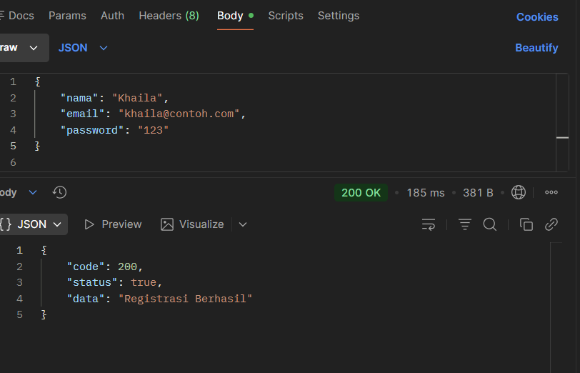
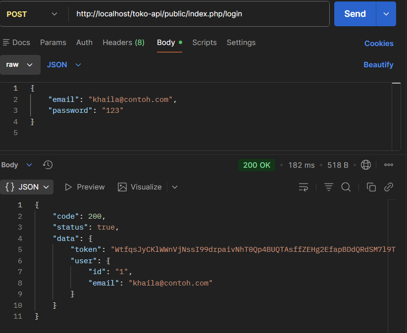
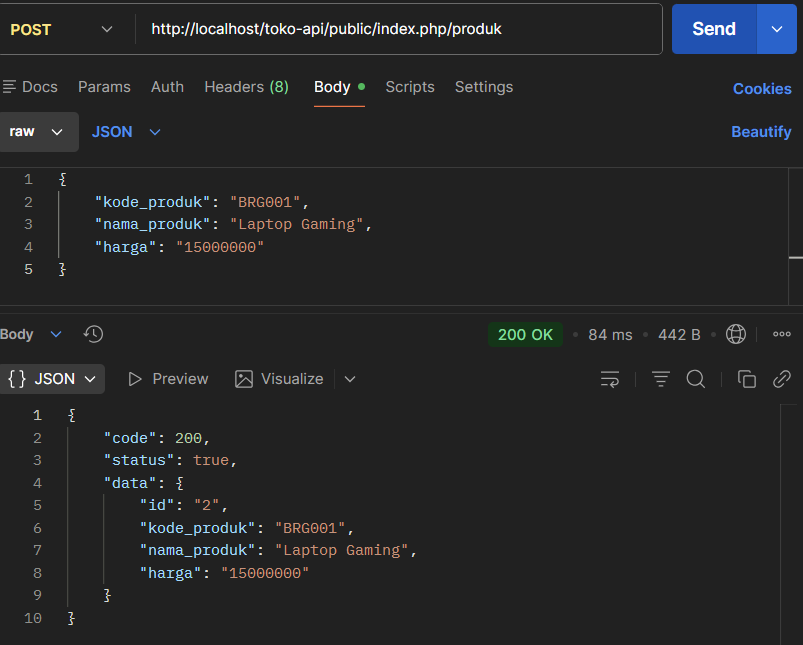
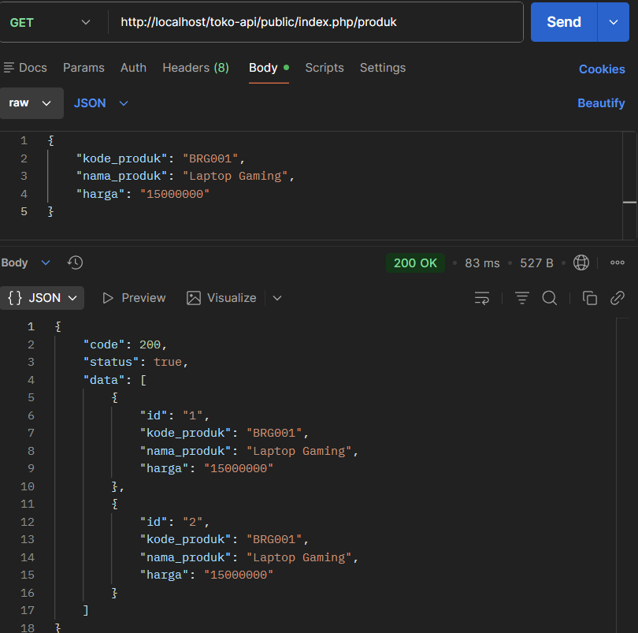
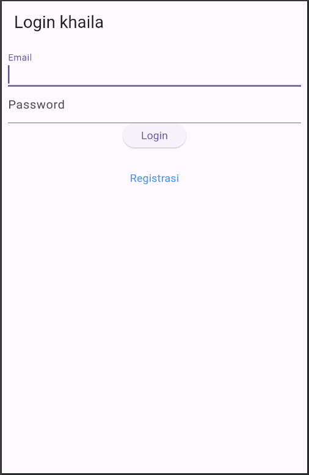
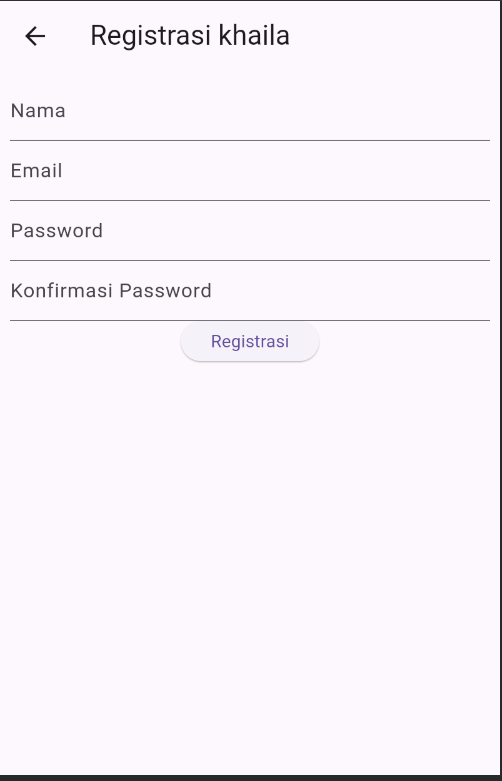
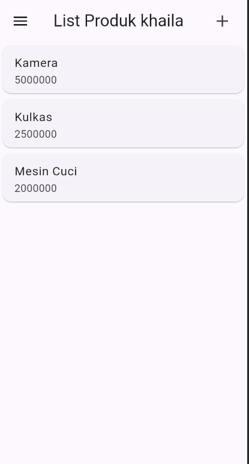
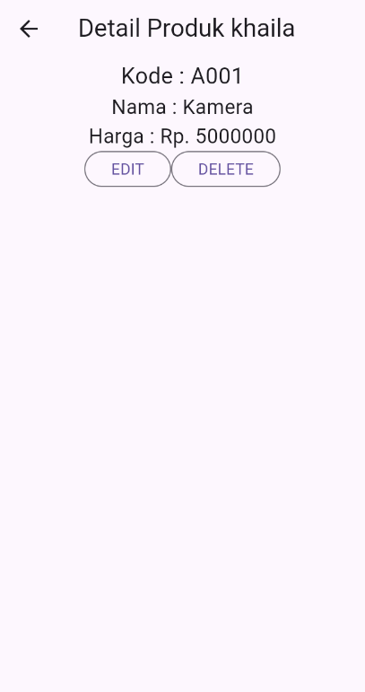
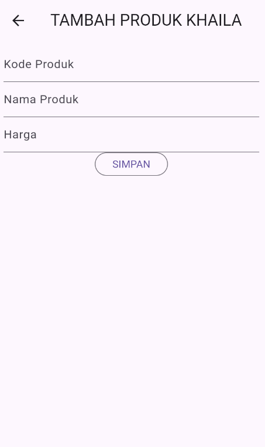

# Laporan Tugas Praktikum Pemrograman Mobile
**Nama:** Khaila salsa marfah bilqis
**NIM:** H1D023030
**Pertemuan:** 10 (CRUD 1)  

---

## A. Pengujian Backend (Rest API)
Sebelum diintegrasikan dengan Flutter, REST API CodeIgniter 4 diuji menggunakan Postman untuk memastikan endpoint berfungsi dengan baik.

### 1. Registrasi & Login
* **Registrasi:** Mengirim data JSON (`nama`, `email`, `password`) ke endpoint `/registrasi`. Response sukses mengembalikan status 200.

* **Login:** Mengirim kredensial untuk mendapatkan `token` autentikasi yang akan digunakan untuk request selanjutnya.

### 2. CRUD Produk
* **Create:** Menambah produk baru (Kode, Nama, Harga).

* **Read (List):** Mengambil array data seluruh produk dalam format JSON.

---

## B. Implementasi UI Flutter & Penjelasan Kode
Berikut adalah implementasi antarmuka aplikasi dengan modifikasi personalisasi pada *Action Bar* serta penjelasan teknis tiap halaman.

### 1. Halaman Login (`ui/login_page.dart`)
Halaman ini berfungsi sebagai gerbang masuk aplikasi.
* **Logika UI:** Menggunakan `TextFormField` di dalam widget `Form` untuk validasi input. [cite_start]Kolom email dan password tidak boleh kosong [cite: 1610-1638].
* [cite_start]**Fitur:** Tombol "Login" memicu validasi form sebelum menjalankan fungsi `_submit` (simulasi loading) [cite: 1641-1647]. [cite_start]Terdapat navigasi menggunakan `Navigator.push` menuju halaman Registrasi bagi pengguna baru[cite: 1657].
* **Modifikasi:** Judul AppBar diset menjadi **"Login Khaila"**.

### 2. Halaman Registrasi (`ui/registrasi_page.dart`)
Form pendaftaran pengguna baru dengan validasi input yang lebih ketat.
* **Validasi:**
    * [cite_start]Nama: Minimal 3 karakter[cite: 1455].
    * [cite_start]Email: Harus format email valid (menggunakan Regex) [cite: 1474-1476].
    * [cite_start]Password: Minimal 6 karakter[cite: 1492].
    * [cite_start]Konfirmasi Password: Harus sama persis dengan input Password[cite: 1507].
* **Modifikasi:** Judul AppBar diset menjadi **"Registrasi Khaila"**.

### 3. Halaman List Produk (`ui/produk_page.dart`)
Dashboard utama yang menampilkan daftar barang dagangan.
* **Struktur Data:** Menggunakan widget `ListView` untuk me-render daftar produk. Data produk dimodelkan menggunakan class `Produk` (di `model/produk.dart`).
* **Navigasi:**
    * [cite_start]Klik ikon `(+)` di AppBar membuka `ProdukForm` dalam mode "Tambah" [cite: 1935-1937].
    * [cite_start]Klik salah satu item produk (`ItemProduk`) membuka `ProdukDetail` [cite: 1990-1994].
    * [cite_start]Terdapat *Sidebar Drawer* untuk fitur Logout [cite: 1942-1953].
* **Modifikasi:** Judul AppBar diset menjadi **"List Produk Khaila"**.

### 4. Halaman Detail Produk (`ui/produk_detail.dart`)
Menampilkan informasi rinci dari produk yang dipilih dari list.
* [cite_start]**Penerimaan Data:** Halaman ini menerima objek `Produk` melalui *constructor*, lalu menampilkan Kode, Nama, dan Harga secara spesifik [cite: 1840-1855].
* **Aksi:**
    * [cite_start]**Tombol Edit:** Membuka `ProdukForm` dengan mengirimkan data produk yang sedang dilihat agar form terisi otomatis [cite: 1864-1870].
    * [cite_start]**Tombol Delete:** Memunculkan `AlertDialog` untuk konfirmasi penghapusan data [cite: 1883-1914].
* **Modifikasi:** Judul AppBar diset menjadi **"Detail Produk Khaila"**.

### 5. Halaman Form Produk (`ui/produk_form.dart`)
Halaman dinamis yang berfungsi ganda (Reusable Widget) untuk menambah atau mengubah data.
* **Logika `isUpdate`:** Di dalam `initState`, sistem mengecek apakah ada data `produk` yang dikirim:
    * [cite_start]**Jika Ada (Mode Edit):** Judul berubah menjadi **"UBAH PRODUK KHAILA"**, tombol menjadi "UBAH", dan kolom input terisi data lama [cite: 1733-1744].
    * [cite_start]**Jika Kosong (Mode Tambah):** Judul menjadi **"TAMBAH PRODUK KHAILA"**, tombol menjadi "SIMPAN", dan form kosong [cite: 1745-1747].
* **Input:** Menggunakan `TextEditingController` untuk mengelola input Kode, Nama, dan Harga.

